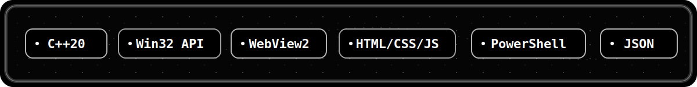

<div align="center">
  

  <h1>Fate / Fateful</h1>

  <a href="https://github.com/EIissu/Fate/releases">
    
  </a>
</div>

## Latest Download

The latest Windows x64 build is available from the Releases page.

```text
Fateful.zip -> Fateful.exe
```

## What This Is

| Versions | Purpose |
| --- | --- |
| Fate | Game. |
| Fateful | Hub for Fate that houses Stats, Wiki, Achievements, and Game History. |

## Fateful Stack

<div align="center">
  
</div>

## Release Notes

- Expanded hub sections for Stats, Wiki, Achievements, and Game History.
- Added a cleaner theme browser with smooth animated scrolling.
- Added profile, friends, and account-focused hub improvements.
- Improved visual polish across the launcher interface.
- Continued groundwork for the Fate game experience.

## Screenshots

Coming soon as the hub and Fate experience continue to evolve.

## Security

Please report security concerns privately to the project owner instead of posting public issues.

## Public Repo Note

GitHub automatically shows `Source code (zip)` and `Source code (tar.gz)` on every release. Those archives are generated by GitHub from this public repository snapshot. This repository is intentionally release-only, so those archives do not contain the private C++ application source.

## Status

| Channel | Platform | Package |
| --- | --- | --- |
| Release | Windows x64 | `Fateful.zip` |

<div align="center">
  <sub>Built for Fate. Shipped through Fateful.</sub>
</div>
